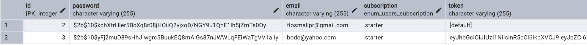

# Contacts REST API

Цей проєкт — простий REST API для роботи з контактами на Node.js.




## Основні можливості

- CRUD-операції через REST API:

  - **GET /api/contacts** — отримати всі контакти (потрібен `Authorization` заголовок)
  - **GET /api/contacts/:id** — отримати контакт за id
  - **POST /api/contacts** — створити новий контакт (поля: name, email, phone)
  - **PUT /api/contacts/:id** — оновити контакт (можна будь-яке з полів)
  - **DELETE /api/contacts/:id** — видалити контакт
  - **PATCH /api/contacts/:id/favorite** — оновити статус favorite контакту

- **PATCH /api/contacts/:id/favorite** — оновити статус favorite контакту

## Автентифікація

- **POST /api/auth/register** — реєстрація нового користувача (поля: email, password)
- **POST /api/auth/login** — логін існуючого користувача (поля: email, password)
- **POST /api/auth/logout** — логаут (потрібен `Authorization` заголовок)
- **GET /api/auth/current** — отримання даних поточного користувача (потрібен `Authorization` заголовок)

## Валідація

- Використовується [Joi](https://joi.dev/) для перевірки даних при створенні та оновленні контакту.

## Як запустити

1. Встановіть залежності:
   ```bash
   npm install
   ```
2. Запустіть сервер:
   ```bash
   npm start
   ```
3. API буде доступне на `http://localhost:3000/api/contacts`

## Тестування

- Для перевірки API використовуйте Postman.
